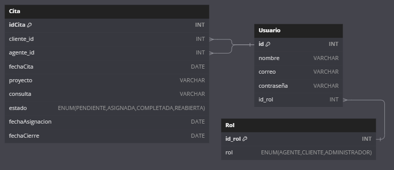
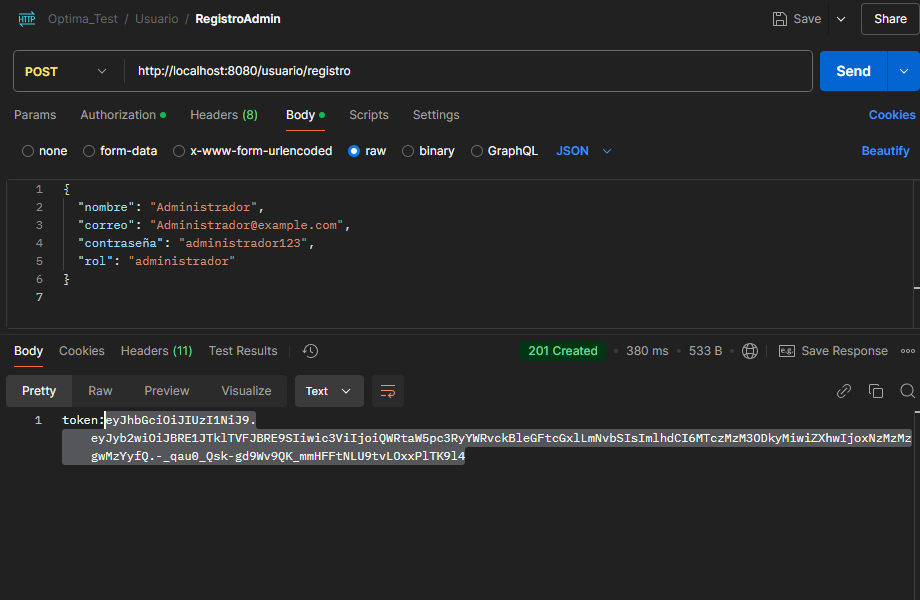
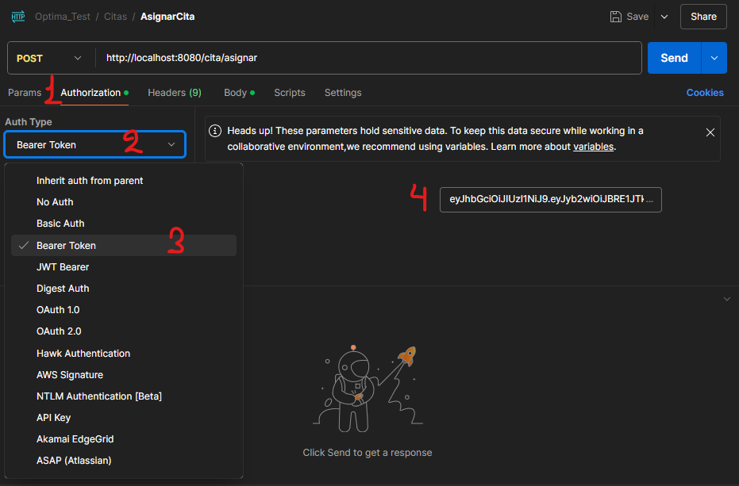
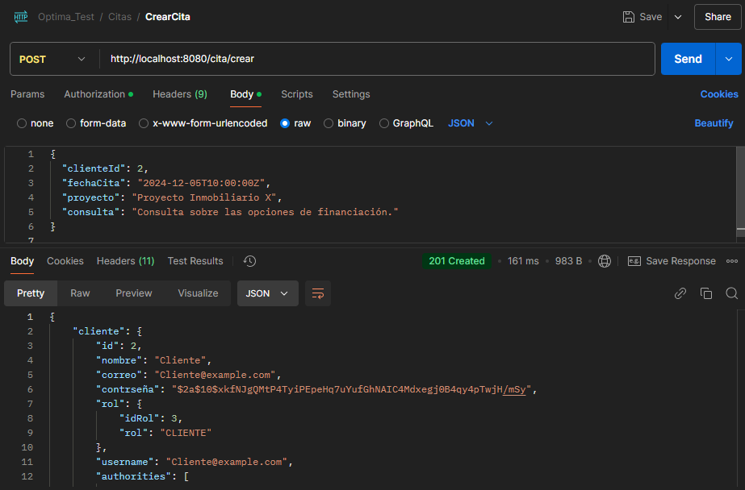
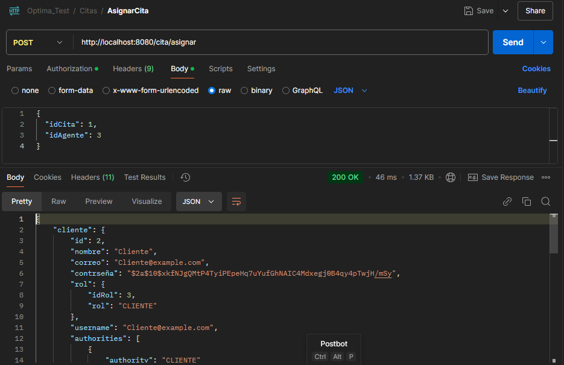
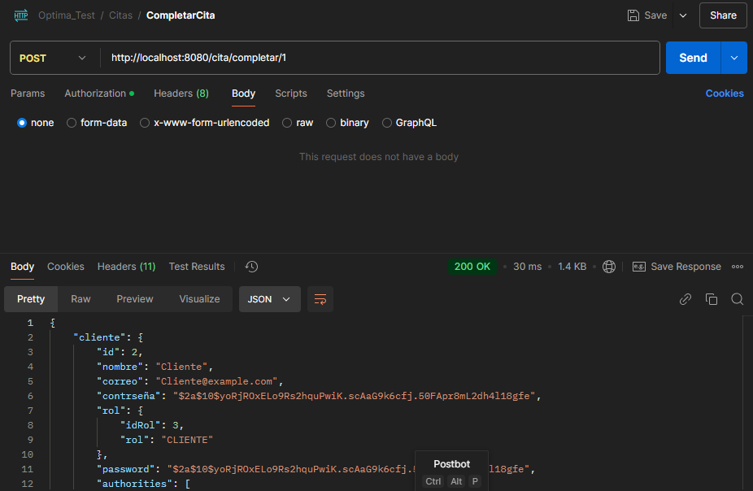
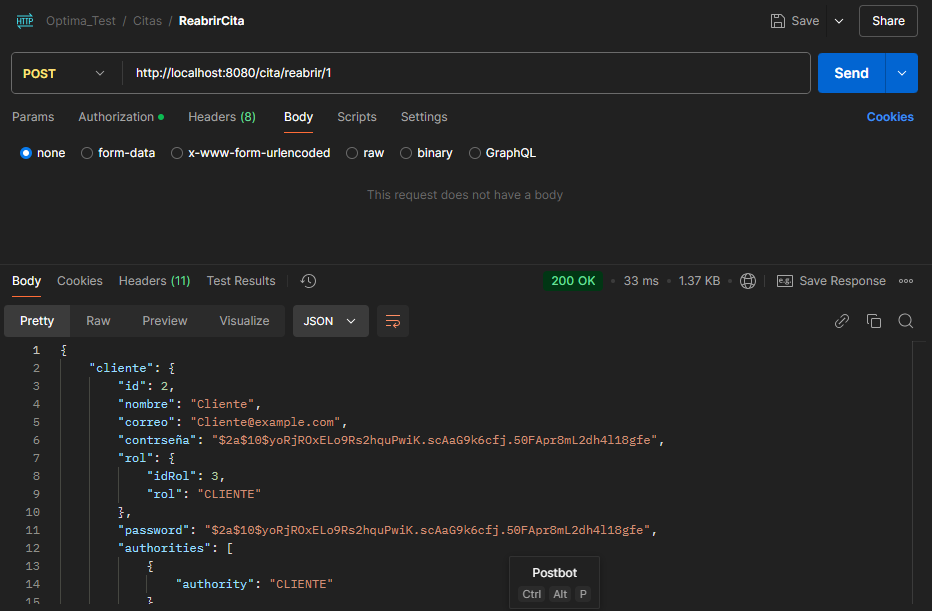

# Sistema de Citas de Optima Inmobiliaria

Este proyecto es una aplicación para la gestión de citas de clientes y agentes en **Optima Inmobiliaria**. Permite la creación de usuarios, gestión de citas, asignación de agentes y seguimiento de citas pendientes y completadas.

## Tecnologías Utilizadas

- **Spring Boot**: Framework principal para la aplicación.
- **Spring Data JPA**: Para la persistencia de datos en la base de datos MySQL.
- **Spring Security**: Para manejar la autenticación y autorización.
- **JWT (JSON Web Tokens)**: Para la autenticación basada en tokens.
- **MySQL**: Base de datos utilizada para almacenar la información de citas y usuarios.
- **Hibernate Validator**: Para la validación de las entradas de los usuarios.

## Requisitos

- **Java 17** o superior.
- **MySQL**: Base de datos configurada para almacenar las citas y usuarios.
- **Maven**: Para la construcción y administración del proyecto.

## Configuración

### 1. Clonar el Repositorio

```bash
git clone https://github.com/CesarAlarcongG/-Sistema-de-citas-de-Optima-Inmobiliaria.git
```
### 2. Iniciar la Base de Datos MySQL
   Asegúrate de tener MySQL instalado y en ejecución. Usa las siguientes credenciales para acceder:

- Usuario: root
- Contraseña: (dejar en blanco si no tienes contraseña configurada)

## Diseño de Base de datos
Tomando en cuenta el caso de esta prueba tecnica, identifique 3 entidades las cuales son
1. Usuario
2. Cita
3. Rol

Cuyas cardinalidades son



- Rol → Usuario: 1:N (Un rol está asociado con múltiples usuarios).

- Usuario → Cita (cliente): 1:N (Un cliente tiene múltiples citas).

- Usuario → Cita (agente): 1:N (Un agente tiene múltiples citas).

## Ejemplo de uso de los End Points

### 1. Registrar Usuario

Para registrar el usuario se debe hacer uso de este endpoint

```bash
http://localhost:8080/usuario/registro
```

El JSON que se debe enviar debe tener este formato

```json
{
  "nombre": "Administrador",
  "correo": "Administrador@ejemplo.com",
  "contraseña": "administrador123",
  "rol": "" 
}

```
###### En el campo rol se debe poner el tipo de usuario que desea crear (ADMINISTRADOR, AGENTE, CLIENTE)
Este endpoint devuelva un JWT, este debe ser copiado para luego escribirlo en las cabeceras de autorización

#### 1.1 Uso de jwt en postman

Para usar el jwt que devuelve el endpoint de registro o loggin debemos copiar el jwt que devuelve el loggin o registro

Nos dirigimos al request del endpoint que es privado

1. Selecciónamos el apartado Authorities
2. Desplegamos "Auth Type"
3. Seleccionamos "Bearer Token"
4. Pegamos el token que copiamos del registro o loggin

Los siguientes endpoints son privados por lo que requieren del token

### 2. Crear cita

Se debe hacer uso de este endpoint

```bash
http://localhost:8080/cita/crear
```

El JSON que se debe enviar debe tener este formato

```json
{
  "clienteId": 2,
  "fechaCita": "2024-12-05T10:00:00Z",
  "proyecto": "Proyecto Inmobiliario X",
  "consulta": "Consulta sobre las opciones de financiación."
}
```


Jwt que debemos usar -> Cliente o Administrador

### 3. Asignar cita

Se debe hacer uso de este endpoint

```bash
http://localhost:8080/cita/asignar
```

El JSON que se debe enviar debe tener este formato

```json
{
  "idCita": 1,
  "idAgente": 3
}
```

Jwt que debemos usar -> Administrador

### 4. Completar cita

Se debe hacer uso de este endpoint

```bash
http://localhost:8080/cita/completar/{idCita} //Este campo debe tener el id de la cita
```

Este endpoint no requiere de un json


Jwt que debemos usar -> Agente o Administrador

### 5. Reabrir cita

Se debe hacer uso de este endpoint

```bash
http://localhost:8080/cita/completar/{idCita} //Este campo debe tener el id de la cita
```

Este endpoint no requiere de un json


Jwt que debemos usar -> Administrador
